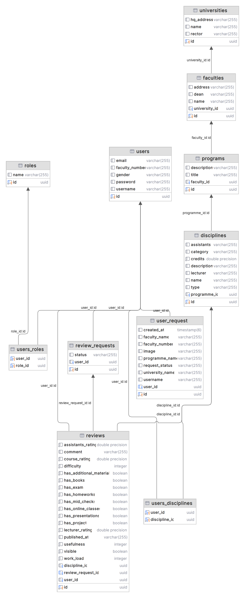

# RateUni
RateUni е система, позволяваща създаването на рецензии и 
оценки за университети и специалности. Системата позволява следните функционалности и видове потребители:

## Видове потребители
### Анонимен потребител
### Регистриран потребител - студент
Може да преглежда дисциплините, към които е записан, данните за него и за университета, където учи. Може да пише рецензии за дисциплините, към които е записан, като те трябва да бъдат одобрени от университетския администратор/асистент.
### Регистриран потребител - университетски администратор
Целта му е да добавя дисциплините към системата и да проверява мненията на студентите дали съдържат вулгарни изрази и може да добавя асистенти.
### Асистент
Помага на университетския администратор.
### Администратор на системата
Добавя университети и университетски администратор.

## Функционалности
### Преглед на дисциплина
Позволява на нерегистриран и потребител и студент да преглеждат дисциплината и нейните мнения.

### Писане на рецензия
Студентът може да пише само по една рецензия за всяка дисциплина, която е записал/а и се изпраща заявка за валидиране на рецензията към университетския администратор/асистент.

### Преглед на рецензия
Всеки потребител може да преглежда рецензия за конкретна дисциплина.

### Добавяне на университет
Администратора да добавя университет в системата, като трябва да предостави и потвърди следната информация: име на университета, адрес на ректората, университетски администратор и асистент.

### Добавяне на дисциплина
Този use case позволява на асистента да добавя или обновява курсове в системата, като трябва да предостави следните данни за курса: име, преподаватели, линк към конспект, описание, кредити, вид, катедра и университет (факултет).

## Aрхитектура
Архитектурата е разпределена на слоеве: контролери -> сървиси -> CRUD сървиси -> репозиторита -> база данни.
CRUD service-ите се използват за подаване на валидни данни и преизползване на код.
Oбменът на данни между слоевете е двупосочен.

## Използвани технологии
<ul>
    <li>Spring Framework и Spring Boot за разработка на уеб приложението.</li>
    <li>PostgreSQL за съхранение на данните в база.</li>
    <li>Hibernate за ORM</li>
    <li>Lombok за автоматично генериране на код.</li>
    <li>MapStruct за мапиране между DTO (Data Transfer Object) и Entity класове.</li>
    <li>Spring Security за конфигуриране на CORS.</li>
    <li>Angular за front-end</li>
</ul>

## База данни


## Query
```
@Query("select r from Review r where r.discipline.id = :disciplineId and r.visible = true")
List<Review> findReviewsByDisciplineId(@Param("disciplineId") UUID disciplineId);
```

Горепосочения код създава Query, което извлича всички дисциплини, които съдържат даден disciplineId и са видими.

